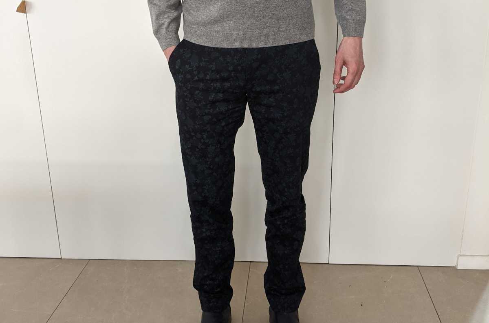

We've just published FreeSewing v2.15 and it comes with a new pattern:
[The Carlie Chinos trouser pattern](/designs/charlie/).

I have lost track of how long a chino trouser pattern is on my todo list,
but it's measured in years. I'm very happy I finally landed where I wanted to be.

I have a picture of it here, but due to the dark fabric, you can't really make out much:

So instead, let me tell you about who I am so excited about this.

##### Based on Titan

First up, Charlie is based on Titan, our unisex trouser block that is also the
foundation for [our Paco pattern](/designs/paco/). So if you're familiar with 
any these, you already know how Charlie will fit you.

##### More measurements, more options, better fit

As a token of how much I feel this is an improvement, I've deprecated [Theo](/designs/theo/). 
Based on an Aldrich draft, Theo uses very few measurements
and while that worked fine for a certain set of people, it is a less versatile pattern.

Charlie will adapt better to differently shaped bodies, and has a hell of a lot more options
that allow you to configure your trousers so you get them just as you like. In case you're
wondering, Theo has 5 options, whereas Charlie has 31.

That being said, we will keep Theo available. Deprecated merely means that we've added a little
warning message saying that we recommend Charlie instead.

##### Easier to make

Another reason to opt for Charlie rather than Theo: Charlie is easier to make.
It has a more straight-forward fly and waistband construction, and the front
pockets have been cleverly designed to give you the ease of construction that
comes with side-seam pockets, yet the classic look of slanted pockets.

Theo ranks 4 stars on our difficulty scale, and I've given Charlie 3 stars.
If you were afraid of making trousers, this might be the pattern you've been waiting for.

##### Real pockets

Charlie is a unisex pattern and the pockets are real. You have welt (aka jetted) pockets at the back, 
and slanted pockets at the front.
In both cases, you have control over the size and depth of the pockets.

The front pockets deserve a special mention. They look like traditional slanted pockets, but are
set in on the side seam. To make that possible, the back panel of the trousers wraps around the front,
following the pocket slant.

## Other 2.15 news

Charlie is the main act, but there's a lot of work that went in this 2.15 release.

As always, [the changelog](https://github.com/freesewing/freesewing/blob/develop/CHANGELOG.md) has
all the details, but allow me to highlight some of the more noteworthy changes:

 - We have [a new bartack plugin](https://freesewing.dev/reference/plugins/bartack/)
 - The [buttons plugin](https://freesewing.dev/reference/plugins/buttons/) provides 
 new [buttonhole-start](https://freesewing.dev/reference/snippets/buttonhole-start) 
 and [buttonhole-end](https://freesewing.dev/reference/snippets/buttonhole-end) snippets 
 - The [dimension plugin](https://freesewing.dev/reference/plugins/dimension/) provides 
 a new [rmad macro](https://freesewing.dev/reference/macros/rmad/)
 - The [logo plugin](https://freesewing.dev/reference/plugins/logo/) now supports dark mode
 - Titan and Paco have a new `waistbandHeight` option
 - Core no longer rounds point coordinates to avoid misses when using [path.split](https://freesewing.dev/reference/api/path/split/)
 - [Bella](/designs/bella/) has a fix to the shoulder to better accommodate doll-sized clothing
 - [Charlie](/designs/charlie/) is the first pattern to list some of the absolute dimensions when configuring
 a pattern, but we plan to extend this to other designs. 
 We have documented [the new raise methods](https://freesewing.dev/reference/api/part/raise) for designers
 who want to utilize this feature.
 - Speaking of documentation, our examples in our [documentation for developers](https://freesewing.dev/) now
 allows you to toggle a switch to reveal the points and paths in the examples
 - The [part.getId()](https://freesewing.dev/reference/api/part/getid/) method now takes a prefix argument

